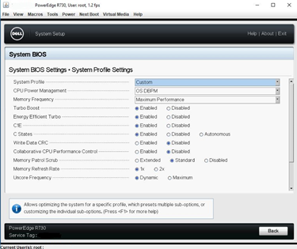
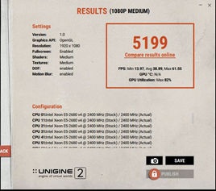
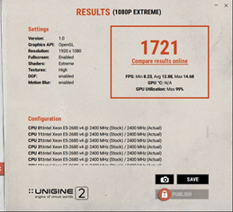
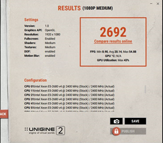
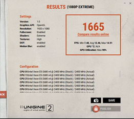
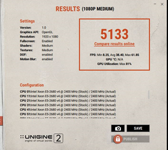
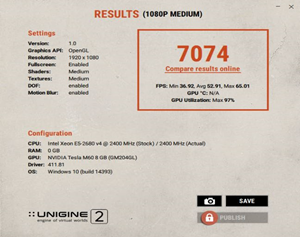
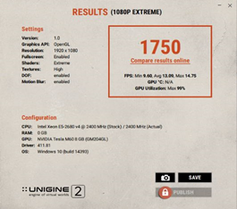

# A Tale of Two Servers: How BIOS Settings Can Affect Your Apps and GPU Performance

> **Archival copy.** Originally written by **Tobias Kreidl** and published on the Citrix User Group Community (CUGC / mycugc.org) on March 7, 2019.
>
> Original (offline): <https://www.mycugc.org/blogs/tobias-kreidl/2019/03/07/tale-of-two-servers-bios-settings-affect-apps-gpu>  
> Source capture: [Wayback Machine, 2022-05-27](https://web.archive.org/web/20220527221535/https://www.mycugc.org/blogs/tobias-kreidl/2019/03/07/tale-of-two-servers-bios-settings-affect-apps-gpu)
  
## Introduction

Charles Dickens most certainly got it right when he wrote in his quintessential novel:

 “It was the best of times, it was the worst of times, it was the age of wisdom, it was the age of foolishness, it was the epoch of belief, it was the epoch of incredulity, it was the season of Light, it was the season of Darkness, it was the spring of hope, it was the winter of despair, we had everything before us, we had nothing before us, we were all going direct to Heaven, we were all going direct the other way – in short, the period was so far like the present period, that some of its noisiest authorities insisted on its being received, for good or for evil, in the superlative degree of comparison only.”

Dickens obviously was not confronted with configuring servers and many of the nuances they seem to require to get them running well. He most certainly had enough troubles of his own, just different ones from the sort that system architects and administrators now encounter some 160 years later.

This tale is about two specific servers, the Dell R720 and R730, of which we still have quite a few in production (along with some newer R740 units). It could also be said that it’s about two R730 servers, with different BIOS settings. It also involves GPUs, to thicken the plot.

This is above all a cautionary tale, for if nothing else, the lesson for us all is to not assume that the out of the box BIOS/firmware settings of a server are going to yield the best results. And the corollary is that one should not assume that the same settings will hold true over different controller model releases, in particular if the controller release (iDRAC in this case) changes in major ways from one version to another, not to mention that BIOS updates can obviate earlier settings and functionality.

But, I get ahead of myself.

Do note that while I’m going to be talking about experiences with running XenServer 7.X on these servers, the same caveats can pertain to whatever operating system or hypervisor might be installed.

## The Plot Thickens

It all started with experimenting with turning on and running turbo features with various C-states enabled on a number of R720 and R730 units running XenServer. Citrix has gone back and forth on the pros and cons of turbo boosts, and some say to just run all virtual CPUs with the maximum fixed highest available clock rate is the way to go, while others counter that turbo boost – if properly implemented – can make a big performance difference. The specific applications run on the unit also weigh in, of course. I’m not going to debate this here, but rather investigate what happens if you do leverage turbo mode, whether you’re a fan of it or not.

In any case, there are a number of options to view and adjust settings with a routine called xenpm and these were working perfectly well on the R720 servers, but not on the R730 units. It was not as if I needed this on the R720, for it was behaving as expected; I wanted to see how the R720 settings compared to those of the R730 making use of the xenpm utillity. I went back to look at the BIOS settings on the R730 machines, which are quite different given that the R720 uses an iDRAC7 whereas the R730 makes use of the iDRAC8. In the case of the R730, I made sure turbo mode was enabled on my test server, as well as C-states, yet I was getting either errors or no output at all from various forms of the xenpm command. The lack of output, according to what I had read, meant something was amiss in the configuration. Furthermore, the R720 had some settings that are apparently not replicated on the R730, such as “Performance per Watt(OS)." This, however, provided in and of itself a bit of a clue.

To exacerbate my frustration, I had seen a number of articles about Linux where CPU frequency scaling was mentioned and where people discussed entries that controlled turbo functions in files such as:

/sys/devices/system/cpu\*/cpufreq/scaling-governor

and no such entries were found on XS 7.1 or 7.6 – not even close. Plus, with the latest R730 BIOS at the time of this writing updated to 2.9.1, the iDRAC interface itself seemed a bit different from earlier versions.

And in fact, to give away the main issue about settings early on in this blog, thanks to some good conversations with some of the smart folks I know, the main issue was attributed to the BIOS being set to “System DBPM” when it needed to be “OS DBPM” (Demand Based Power Management)! Recall the “Performance per Watt(OS)” setting mentioned above; the clue is in the “OS” portion. In fact, Red Hat states specifically in the article <https://access.redhat.com/articles/2207751> that a server should be set for OS (operating system) performance as otherwise, the operating system (in this case, XenServer) cannot gain access to control the CPU power management, which ties in with the ability to manage also the CPU frequency settings. Voila!

Note that on the R730, to make this setting, in the BIOS setup you apparently have to pick the “Custom” System Profile option so that access to that option becomes visible, as seen below:

 

There is a great article at:

<https://xenserver.org/partners/developing-products-for-xenserver/19-dev-help/138-xs-dev-perf-turbo.html>

which discusses turbo boost in the XenServer environment, specifically. Among other important factoids, it mentions that while C-states do not necessarily need to be enabled to allow for turbo boost to kick in, without them enabled, turbo mode being leveraged is “significantly less likely to occur.” P-states and C-states should be fully enabled. One article referred to within that document (CTX132714) about removing manufacturer’s settings that disable these states seems to have unfortunately disappeared.  
  

## Standard vs. New Settings

Before getting into details, let’s first take a look at how a R730 server without turbo boost enabled and with a fixed maximum CPU speed on all processors compares with running the same benchmarks on an R730 server with turbo mode enabled, but *<u>incorrectly configured</u>*.

First off, here are the specs of the R730 servers, which are identical except for some BIOS settings:

Dell R730, dual Intel Xeon E5-2680 v4 CPUs @ 2.40 GHz, 14 cores (28 total), 28 hyperthreads (56 total), 256 GB 2400 MHz RAM, XenServer 7.6 fully patched as of this writing, NVIDIA M60 GPU running GRID 7.1 drivers. Do I wish I had higher intrinsic clock speeds at the expense of fewer cores? Yes, but this is what I had to work with.

For the main benchmark, I was running the free Windows version of the Unigine Superposition benchmark (<https://benchmark.unigine.com/superposition>) on Windows Server 2016 Standard virtual machines (VMs) that are configured identically. No other VMs were running on the XenServer instances. Here are the results of two runs, one with “1080p medium,” the other “1080p extreme” benchmarks. Above all, the desire was to see how the GPU performance was impacted by factors dictated in part by the CPU and server configuration, overall. Note that one set of benchmarks was run ten times to check for consistency and other than some variation in the minimum frames per second (FPS) metric and GPU load for the “1080p medium” test, all others had standard deviations from the mean of less than 1%. In other words, the consistency was very good.

Here are the results of running on a server with all virtual CPUs running fixed at 2.40 GHz and turbo mode disabled:

  
  

  
  
  
  
  
  
  
  
  
  
  
  
  
  
  
  
  
These are the results from the *incorrectly* configured server that was set up to supposedly make use of turbo mode:  
  
  
  
  
  
  
  
  
  
  
  
  
  
  
  
  
  
  
  
  
There is actually a *reduction* in performance of around 48% and 3%, respectively, in the turbo version – not what I initially expected. The first benchmark metric (1080p medium) is actually more important, in my opinion, because it should be more representative of an actual user environment where a single process is less likely to consume the entire GPU and may need to share it even with other users. The CPU load is also important as the overall performance of the server will also weigh in. With big data sets, there is a fair amount of I/O needed to keep the flow of data in and out of the GPU memory moving and hence faster CPUs are generally more desirable. The scope of this article would get way too large if these sorts of details were discussed at length, hence I will leave those topics for another blog or discussion, as interesting as they are.  
  

## Fixing Turbo Mode

The next step is to fix the turbo boost so that it’s functional. On many servers, this can be done with a BIOS setting; it certainly works that way on an R720. To do this on the R730, we first of all set the CPU Power Management parameter in the BIOS to “OS DBPM” and reboot. We also have in the case of the R730 no obvious way I could at least find to adjust the frequency governor in the BIOS, hence I did this with the CLI command (to change it from its initial value of “ondemand”):

xenpm set-scaling-governor performance

This is put in place and is effective immediately. To make the setting permanent over reboots, you need to run:

/opt/xensource/libexec/xen-cmdline --set-xen cpufreq=xen:performance

This needs be run on each XenServer host. To test if turbo mode is enabled, use the command:

xenpm get-cpufreq-para \| grep turbo

and it should state “turbo mode: enabled” in the output for each virtual CPU. Note that there is an interesting convention that if a CPU has turbo mode available, it will show in addition to its highest frequency that frequency plus 1 MHz. For example, for a 2.40 GHz system, you see for the scaling frequency output from the “xenpm get-cpufreq-para” command the following values which are in kHz:

scaling_avail_freq   : \*2401000 2400000 2300000 2200000 2100000 2000000 1900000 1800000 1700000 1600000 1500000 1400000 1300000 1200000

The starred entry shows what’s currently in use and in this case it’s indeed 1 MHz (1000 kHz) higher than the nominal maximum CPU clock frequency.  
  
Other useful commands to check the overall state include:

xenpm get-cpuidle-states  
xenpm get-cpufreq-states    
xenpm get-cpufreq-average

To monitor the full state and frequency usage, the command: 

xenpm start \[seconds\]

can be used, where “seconds” is an integer in seconds to collect Cx/Px statistics. To monitor this over the time the benchmarks were run, I used:

watch -n 5 'xenpm start 1\|grep "Avg freq" \|sort \| tail -16'

to check on the largest average frequency states seen every five seconds with a one-second integration time. I also verified that all P-states and C-states were enabled and that the governor had been properly set to “performance”.

These are the results of these changes:

  
  
  
  
  
  
  
  
  
  
  
  
  
  
  
  
  
  
  
  
The metrics compared to those of non-turbo mode are now under 2% different for both the benchmark itself and the GPU utilization. What a difference! The maximum CPU frequency in both these cases rose from 2.40 GHz to 2.881 GHz, an improvement of around 20%.

With further tweaks -- that will remain the topic of a different discussion -- I was able to better these benchmarks to:  
  

  
  
  
  
  
  
  
  
  
  
  
  
  
  
  
  
  
  
  
This translates to an increase over the non-turbo version benchmark by around 36% and nearly 2% for the “1080p extreme” case and the GPU utilization rises from 82% to 97% for the “1080p medium” run. Furthermore, in this more optimized configuration the maximum CPU frequency rises from 2.40 GHz to 3.145 GHz, or over 31%.  
  

## Summary

First and foremost, take the time to review your hardware and make sure it’s configured such that it will be as tailored as best as possible to your specific environment. Things change over time, so review periodically the settings and see if they still make sense with your current needs. That requires monitoring your setup and tracking the performance over time. There are a plethora of good tools and utilities to make that possible. 

The GPU performance *does* depend on the CPU and various other server and system settings; don’t take for granted that it’s going to be just fine out of the box. Experiment a sufficient amount of time with various settings until you have it working as best as you think possible. Remember, though, that a test environment will not behave the same way as your production environment, hence take what you come up with with a grain of salt and expect to monitor and refine settings over time.

GPUs can make a huge difference in the performance of applications, but they cannot do so if the environment in which they are used isn’t optimized. Your setup is only as good as the weakest link in the chain. Of course, some compromises will often need to be made based on cost, space, time, power, and other factors. Bear in mind what apps are going to push the limits and when and where bottlenecks might take place.

Finally, keep your end users in the loop. You want to keep them happy and they will be the first to let you know if something isn’t looking normal, and take them seriously no matter what the metrics might report. Listen to their input.

## Acknowledgements

I would like to thank a number of folks of the NVIDIA vGPU Community Advocate (NGCA) group for very useful tips and enlightening discussions, in particular Ben Jones, Ronald Grass, Rasmus Raun-Nielsen, and Jan Hendrik Meier.

  
[\#XenServer](https://www.mycugc.org/search?s=%23XenServer&executesearch=true)  
[\#Application_Delivery](https://www.mycugc.org/search?s=%23Application_Delivery&executesearch=true)  
[\#GPU](https://www.mycugc.org/search?s=%23GPU&executesearch=true)
