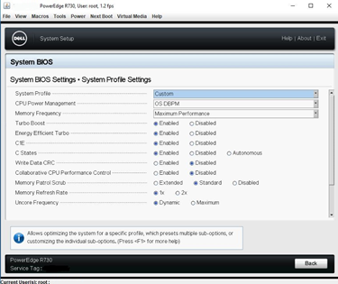
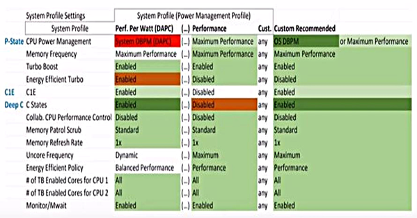
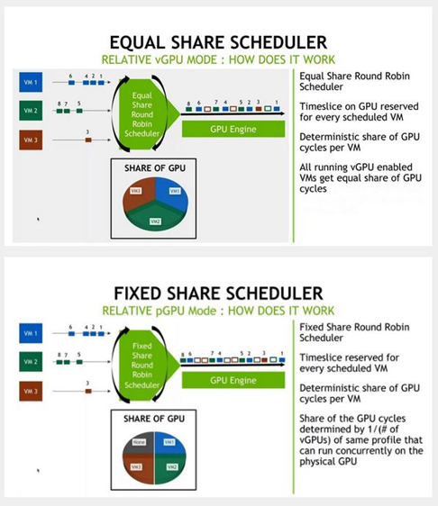

# A Tale of Two Servers, Part 2: How Not Only BIOS Settings, But Also GPU Settings Can Affect Your Apps and GPU Performance

> **Archival copy.** Originally written by **Tobias Kreidl** and published on the Citrix User Group Community (CUGC / mycugc.org) on April 30, 2019.
>
> Original (offline): <https://www.mycugc.org/blogs/tobias-kreidl/2019/04/30/a-tale-of-two-servers-part-2>  
> Source capture: [Wayback Machine, 2022-05-27](https://web.archive.org/web/20220527213026/https://www.mycugc.org/blogs/tobias-kreidl/2019/04/30/a-tale-of-two-servers-part-2)
  
  
Servers can only do their job well if they are optimized and tuned to perform their duties that best suit the applications they run and fulfill the expectations of those who use them. This short series of articles strives to address in particular how the increasingly more common combination of servers and embedded GPUs deserves special attention to bring out the best in both.  

This is a follow-up to the [original article](https://www.mycugc.org/blogs/tobias-kreidl/2019/03/07/tale-of-two-servers-bios-settings-affect-apps-gpu), which dealt primarily with BIOS settings and how they affect CPU and GPU performance. In that article, it was mentioned that further tweaks resulted in an increase over the non-turbo version GPU benchmark by around 36% for the “1080p medium” and nearly 2% for the “1080p extreme” case and the GPU utilization rising from 82% to 97% for the “1080p medium” run. Furthermore, in this more optimized configuration, the maximum CPU frequency rose from 2.40 GHz to 3.145 GHz, or over 31%.

  

In this installment, I will go into a few more details and clarifications regarding the BIOS settings and discuss a bit more the roll of the GPU. In the next installment, there will be a deep dive into the topics of non-uniform memory access (NUMA) and server architecture, sockets/cores-per-socket settings, virtual machines (VMs) and their vCPU and memory assignments, and a summary of how this all comes together to play a role in the end result. The details will also be revealed in the next installment that led to the above-mentioned improvements in the overall VM/GPU performance.

  

In this and the follow-up article, I’d like to go into a bit of more detail how those metrics were achieved as well as dive more deeply into various configuration settings that all contribute to the overall performance of the system. Above all, with server performance suffering as a consequence of necessary BIOS and OS patches due to security vulnerabilities such as Spectre and Meltdown, getting as much out of one’s servers as possible is one way to provide at least partial compensation. A number of items that influence server and GPU performance will be discussed.

  
  

## Revisiting the BIOS

  

Going back to the BIOS settings discussed in the original article, there are a number of settings that ought to be clarified as they are in some cases quite esoteric, yet can make a big difference in how the server performs.

  

Here is a screen shot of those settings from the other article as a reference:

  

  
  

Energy Efficient Turbo allows a processor’s core frequency to be adjusted within the turbo range based on the workload. I have left it at this value as it seems it would probably work well in conjunction with enabling C-states.

  

Here is a little bit more on what the “Uncore Frequency” is and why the choice was made to go with “Dynamic” vs. “Maximum”. The “Uncore Frequency,” known sometime later in history also as the “System Agent,” came about when the Intel Nehalem microarchitecture introduced a flexible architecture allowing optimization for different segments. Core processing functions (ALU, FPU, L1 and L2 cache) are split from the “uncore” functionality; “uncore” is invoked whenever the CPU needs to access data.)

  

Note the “uncore” (System Agent) setting difference:

  

- “Dynamic“: the uncore frequency appears to match the frequency of the fastest core

<!-- -->

- “Maximum“: the uncore frequency typically remains fixed

  

It would appear that “Maximum” would seem like it would give you the best overall performance, but in fact, it can limit the ability of the “uncore” to make use of higher clock rates when those are taking place and hence block its ability to take advantage of the CPU’s highest current clock speed, resulting in a mismatch and a slowdown. Because the CPU is responsible for feeding data to the GPU, it can become a bottleneck, probably most noticeable in the FPS video rates, but also important when a GPU has a lot of data flowing in and out of it because of its own memory limitations. Gamers have been aware of this for a long time and hence have resorted to overclocking of their CPUs to push the envelope.

  

Hence, “Dynamic” appears to be overall a better choice. For more about the “uncore” see for example [this article](https://software.intel.com/en-us/forums/software-tuning-performance-optimization-platform-monitoring/topic/543513).

Power management profiles that are characteristic of a typical Dell server look similar to the following diagram and these are the recommendations for customizing the server to get maximum performance:

 

  

The “uncore” parameter was already discussed above. Worth mentioning in a little more detail is the C1E parameter, which also reduces the CPU voltage in addition to stopping the CPU internal clock. It is known as the “enhanced C state”. If this mode is enabled in the BIOS, the CPU will enter this mode rather than make use of the default Halt (C1) mode when a HLT instruction is issued (see [this article](https://www.hardwaresecrets.com/everything-you-need-to-know-about-the-cpu-c-states-power-saving-modes/)). See also [this additional article](https://downloads.dell.com/solutions/general-solution-resources/White%20Papers/12g_bios_tuning_for_performance_power.pdf) which discusses but does not show in tabular form the “Custom Profile” shown above. One deviation in the recommended custom setting from the “Performance” profile is to enable C-states, which allows the turbo mode to be maximized as it allows cores that are not as busy to idle better and save power all while providing the opportunity to the CPU to run as fast as possible with maximum power. In that article in Figure 14 on page 24, note that other than the dense configuration, which makes use of the System DPM with turbo disabled, the overall power usage averages out to be within a percent of the various other settings. On the other hand, the dense configuration will decrease performance by up to 10% and the average power usage up to around 20%. In our case, however, we are interested in maximizing the performance. Note, however, that there is a certain risk here of encountering a certain degree of performance inconsistency since pushing the turbo to the maximum cannot typically be sustained for long periods of time due to either competition for GPU resources from other users and/or the shift of CPU resources to other tasks. If end user experience (EUX) consistency is desired, turbo mode might actually not be the best setting. The reader is reminded that what may turn out the best for the particular servers discussed here may not be the case on others with different architectures. Always test on equipment as close to the final production environment as possible. The same EUX issue also becomes a matter to take into consideration when looking at NVIDIA GPU scheduling, as will be touched on in the next section.

  

For more on Dell R730 profile settings, see for example [this reference](https://qrl.dell.com/Files/en-us/Html/Manuals/R730/Viewing%20System%20Profile%20Settings%20Screen=GUID-2E9B46A1-71E3-4072-9D86-DB648757F0E6=1=en-us=.html).

  

## GPU Settings

  

Another factor, that was not a concern in the very controlled test environment I used, is that of the GPU scheduling settings. Depending on the GPU model, there are up to three options available in NVIDIA GRID (now rebranded as vGPU)/Tesla GPUs:

  

<u>Best Effort</u> is the oldest, introduced with Kepler and still the only option on Maxwell GPUs and is based on time-sliced round-robin. Scheduling is on a first come, first served basis. An advantage includes the use of all idle cycles, but it has an “unfair” mechanism for competing requests which have to wait, so performance may suffer. No cycles go idle in this model – *some* GPU gets them if any activity is going on. Also, there is no way to pre-allocate resources. This is the only scheduler supported on Kepler and Maxwell GPUs.

  

<u>Equal Share</u> strives to allocate similar resources to all tasks. Each task gets a turn. If, however, there is no activity taking place for a task, it still gets a time slot and the GPU idles during this time, which is not ideal as the time slice is wasted. It is also a round robin style of scheduler and does offer protection from “noisy neighbor” effects. It works also with CUDA computational tasks and is supported on Pascal and newer architectures.

  

<u>Fixed Share</u> is the newest scheduler. It’s also based on a round robin scheduling mechanism, but here assures a fixed rather than equal share of the GPU cycles. This can result in more idle cycles compared to the equal share mechanism, however. For guaranteeing minimum performance, for QoS, it may be the best choice, despite its limitations. For customers using these in the cloud, it may be a good choice. It is also available only on Pascal and later GPU architectures.

  

Depending on your environment, GPU scheduling should be taken into consideration as GPU behavior will be different depending on which model is chosen and what applications your end users are running and how end users perform their work. Note that the default is Best Effort across the board. Here are illustrations of how the Equal Share and Fixed Share schedulers operate:

  

 

  
  
The table below shows the various NVIDIA GPU models along with their scheduling options and associated parameters:  

| Scheduling Mode:            | Best Effort                    | Equal Share           | Fixed Share           |
|-----------------------------|--------------------------------|-----------------------|-----------------------|
| Supported Hardware          | Maxwell, Pascal, Volta, Turing | Pascal, Volta, Turing | Pascal, Volta, Turing |
| Primary Use Cases           | Enterprise                     | Enterprise            | Cloud                 |
| vGPU Aware                  | No                             | Yes                   | Yes                   |
| Mixed computes/graphics     | Supported                      | Recommended           | Recommended           |
| Idle Cycle Redistribution   | Yes                            | No                    | No                    |
| Guaranteed QoS              | No                             | Yes                   | Yes                   |
| Noisy Neighbor Protection   | No                             | Yes                   | Yes                   |
| Frame Rate Limiter Required | Yes                            | No                    | No                    |

  
An informal poll of a few experienced folks who design and deploy this technology resulted in the majority sticking with the tried and proven “Best Effort” scheduler. The most compelling explanation is that it is the only one where idle cycles are not wasted and in industries where every end user has a lot of work to do and GPU loads are heavy, this makes as full use of the GPU cycles as possible. Note, however, that similar to how turbo mode on a CPU can lead to too much undesirable variation in EUX, the Fixed Share scheduler may work out better in some cases, in particular for cloud-based installations since there are more variables involved in the communication links between the server and end user and issues such as latency and packet losses can factor in.

  

The topic on which GPUs are available from different vendors and how to make such selections could easily be a whole separate set of topics to discuss. My personal opinion is that currently, NVIDIA offers the most variety and versatility and is the one vendor I have the most direct experience with.

  

Which model GPU to choose therefore becomes another major topic, along with in the case of NVIDIA GPUs what so-called “profile” to use and whether to dedicate a GPU or portion of it to each VM or to share it among multiple VMs. The ability to carve a GPU into segments of various sizes and licensing types according to ”profiles” and assign them separately to one or more VMs is an important part of the design and implementation process for NVIDIA GPUs. It may well turn out that a single GPU model is not the best option, especially if you have users whose needs cover a broad range of applications and datasets. In some cases, it may be adequate as well as more economical to only provide GPU back ends to the most demanding applications and leave all the work to CPUs for less demanding applications. The combination of XenDesktop and XenApp (Citrix Virtual Desktops and Applications) can work well in such a case as you can map specific XenApp applications to the XenDesktop and users will rarely even notice that those applications are being run on some remote server, yet benefit from the GPU back end that is working behind-the-scenes.

  

It should be mentioned that there are also GPU offerings from AMD, including the S7100X, S7150, S7150x2 and V340 (the latter of which is currently not compatible with XenServer). Support for the AMD FirePro series started with XenServer 7.2 They range from 8 to 32 GB of memory. Intel offers its IRIS Pro graphics series of GPUs that are embedded in its newer E3-xxxx series CPUs. Everything is already integrated and GPU acceleration takes place for any application running on these processors. XenServer 7.1+ supports Intel GVT-d (virtual dedicated graphics acceleration, one VM to one physical GPU) and GVT-g (virtual graphics processing unit, multiple VMs to one physical GPU). In 2020 Intel will supposedly release its Xe line of GPUs, which could become serious contenders in the GPU field. For more about the Xe GPUs, see [here](https://www.tomshardware.com/news/intel-xe-gpu-specs-features,38246.html). Note that currently, none of the AMD or Intel GPU offerings require any software licensing. As competition heats up, it can be expected that AMD will follow up with new offerings at some point, as well.

  

The choice of server and which type and how many GPUs can be accommodated should also be carefully considered. The choice of server has to ensure that whatever GPUs it makes use of won’t hold back GPU performance and also vice-versa. There will always be a limit on how far you can push a component somewhere in the chain of dependencies and the idea is to strive towards not letting a single component dominate that limitation.

  

There are cases where more, less powerful servers can be a better choice than fewer, more powerful servers, as well as the exact opposite. In some cases, it may take some experimentation to find what works best. Whether purchasing for an on-premises installation or figuring out what to rent in the cloud, it may take some experimentation to find a good configuration that best fulfills one’s needs. Cloud-hosted options make changes a lot easier, of course, since they are virtualized instances.

  

No matter what operating system or hypervisor one uses, there are a number of commonalities that make for similar configuration guidelines. The following book contains a lot of very good information on this topic, even for those making use of servers that are not running VMware components, and I can highly recommend it: [Johan van Amersfoort's VDI Design Guide](https://vhojan.nl/finally-the-waiting-is-over-the-vdi-design-guide-is-available/).

  

To maximize end-user density and light to moderate loads, one might decide that the NVIDIA M10 is still the best option for the price, or if greater power, memory or additional processing options are more important, perhaps the newer P4 or T4 units. Two T4 units will provide the same or possibly even greater end-user density while taking up the same amount of server space (two slots) as an M10, however with only about half the power consumption and quite a bit more GPU processing power. Cost, power, available slots, and GPU performance and what is supported on various servers will all play a role in the decision-making process.

  

It is also important in the case of NVIDIA GPUs to have a thorough understand of the licensing models, which impact both the server and client sides and also require running a separate license server. The details are far beyond the scope of this article, but can be seen in detail in the [recent document revision](https://images.nvidia.com/content/grid/pdf/161207-GRID-Packaging-and-Licensing-Guide.pdf).

  

If making a purchase of hardware, be aware that many vendors will sell only specific configurations that are known to work reliably and they are willing to support. If you are retrofitting a server with GPUs, be aware of its limitations and the possibility of voiding the warranty if certain limits are exceeded.

  
  

## Before Moving On To the Next Installment

  

This article covered some additional details on the effects of various BIOS settings, a bit more about system internals, and GPU scheduling. The variety of GPUs to choose from makes the decision more difficult these days, but competition is generally a good thing for many industries. Good research and detailed discussions with sales engineers and possibly consultants should be planned for. All the tweaks possible may still not be enough to provide a solid enough platform if inadequate components are chosen at the onset. When testing, be careful to change if possible only one parameter at the time and run application benchmarks preferably that are sometimes available for the particular applications, themselves. Consider running a variety of benchmarks and repeat often enough to be able to get similar results. Load testing software can also be beneficial if used and interpreted correctly.

  

Testing can be a very time-consuming process, but can make all the difference in terms of EUX as well as being able to right-size the system holistically.

  
As mentioned in the beginning of this blog post, the next installment will go into the details that led to significant improvements in overall VM performance and will cover a variety of configuration topics that are important once your servers and GPUs are set up and ready to host VMs.  
  
[\#XenServer](https://www.mycugc.org/search?s=%23XenServer&executesearch=true)  
[\#Application_Delivery](https://www.mycugc.org/search?s=%23Application_Delivery&executesearch=true)  
\#GPU  
  
Tobias Kreidl can be reached on Twitter at: @tkreidl
