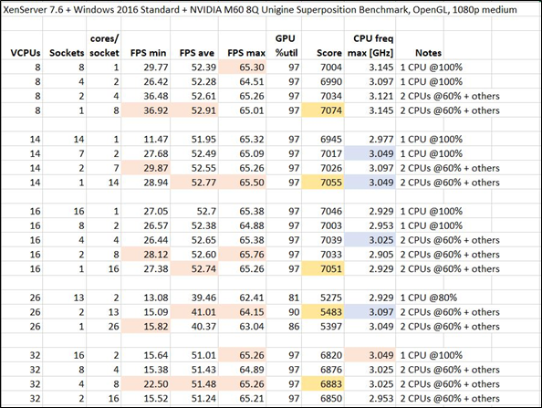

# A Tale of Two Servers, Part 3: The Influence of NUMA, CPUs and Sockets/Cores-per-Socket, plus Other VM Settings on Apps and GPU Performance

> **Archival copy.** Originally written by **Tobias Kreidl** and published on the Citrix User Group Community (CUGC / mycugc.org) on April 30, 2019.
>
> Original (offline): <https://www.mycugc.org/blogs/tobias-kreidl/2019/04/30/a-tale-of-two-servers-part-3>  
> Source capture: [Wayback Machine, 2022-05-27](https://web.archive.org/web/20220527215004/https://www.mycugc.org/blogs/tobias-kreidl/2019/04/30/a-tale-of-two-servers-part-3)
  
  
The previous installment discussed some more details of the influence of BIOS settings on performance and also discussed the importance of the choice and configuration of GPUs, including some discussion of the GPU scheduler, which is specific to the NVIDIA Tesla line of GPUs. In this follow-up blog to [Part 2](https://www.mycugc.org/blogs/tobias-kreidl/2019/04/30/a-tale-of-two-servers-part-2), the long-awaited detailed discussion of how the overall performance gains were realized over the stock configuration are presented. A number of interesting side topics are also brought into the discussion, and a summary of the overall tale is given at the end as a set of guidelines that may prove useful to those dealing with CPU/GPU configurations. That goal has certainly been my intention all along.

## NUMA, CPUs and Sockets/Cores-per-Socket Settings

This covers a lot of territory, but will be kept relatively brief in the interest of not getting too long and too detailed. There are certainly a number of excellent articles on these topics. Many of these settings can make a difference in performance and it gets tricky because they are all inter-related to one degree or another, hence changing one parameter will likely have some sort of influence on the others. This, in turn, makes testing harder as ideally, you want to only alter one variable at the time so that you don’t have to try to untangle cross-correlations. In reality, it’s not always possible to do so, but fortunately, it is possible to see in some cases where another parameter starts to play a significant role after a change is made.

Here is a table showing comparisons of the benchmark metrics with different vCPU and sockets/core-per-socket counts:  
  

  
These were all run with no other activity present on the server and under as identical conditions as possible. With the exception of the FPS minimum, a test of ten runs with one of the settings resulted in standard deviations from the mean of less than 1%. The various maximum values achieved are highlighted. Contrary to expectations, some of the results come close, despite quite different parameters.

There are a number of very interesting observations that can be gleaned from this table. First of all, note that this particular server has 14 cores and 28 hyperthreads per physical CPU. There was also less memory assigned than half the total system memory (256 GB) to the VM, which would otherwise force virtual NUMA (vNUMA) to kick in regardless. In this case 119 GB was chosen and hence vNUMA will still kick in as soon as a VM is assigned more cores than are available on a socket. Note also that even if all the vCPUs can fit within a single NUMA node, depending on how much memory the VM uses and also when the VM was started up, there might not have been adequate memory available for it to all fit on the same NUMA node and hence the decreased performance due to the memory interconnect to the other NUMA node kicks in. I was made aware by Frank Denneman that for example with VMware ESX that the allocation of VMs is driven by trying to place them as best as possible to be contained within a single NUMA node without factoring in that the memory requirements may still force vNUMA to be invoked because of there not being enough available on a NUMA node. As will be emphasized later, the order in which VMs are started up therefore can be important!

This topic goes deeper, though, because if hyperthreading is enabled, can’t you double the number of vCPUs and still avoid NUMA since the vCPUs can all be assigned to the same physical CPU socket (using, for example CPU pinning)? Yes, while this is true, the disadvantage of doing so can come about because you are trying to run processes on twice as many physical cores as exist and hence you are over-loading the number of execution resources. This is discussed and illustrated nicely in [this article](http://wahlnetwork.com/2013/09/30/hyper-threading-gotcha-virtual-machine-vcpu-sizing/).

Note that this depends further on whether or not the L1TF (L1 Terminal Fault speculative execution side-channel exploit – see for example [this article](https://www.intel.com/content/www/us/en/architecture-and-technology/l1tf.html)) patch is in place or not as if so, no two workloads will share the same core.

However, most systems will nevertheless recognize this as being non-optimal and therefore by default, the cores-per-socket count will create extra vNUMA nodes if the number of total vCPUs exceeds the number of cores (*not* hyperthreads!). Note that while this appears to be the case for XenServer/Xen, it differs among ESXi versions. Frank Denneman suggests in this case to look at PPD and VPD mappings and investigate with the vmdumper utility.

The job of assigning vCPUs to cores is up to the CPU scheduler. Bearing that in mind, let’s see how badly this affects performance as well as what happens when NUMA kicks in.

With 8 vCPUs, everything should fit nicely on one socket and this configuration, where they fit nicely, wins overall. With 14 vCPUs, this should just fill the cores of one CPU’s socket, and it does just about as well as an 8 vCPU configuration. With 16 vCPUs, vNUMA should kick in (16 exceeds the physical core count), but the hyperthreading effect is apparently still mostly avoided. The result is performance also very close to that of the 8 vCPU configuration.

Note that configuring a VM with any odd number of vCPUs that exceeds the number of cores (or hyperthreads, in this case) on a socket can make for a suboptimal configuration and should generally be avoided (though there are some strange exceptions!). If the amount of memory exceeds that assigned to a socket, <u>any</u> odd number of vCPUs for a VM should typically be avoided since it can cause vNUMA to be invoked in such cases and in addition, create an imbalance in how the vCPUs are divided between CPU sockets and create potentially an even less ideal competition for memory (see, for example, [this article](https://blogs.vmware.com/performance/2017/03/virtual-machine-vcpu-and-vnuma-rightsizing-rules-of-thumb.html)).

Even an even number of vCPUs can lead to poorer performance, as seen in the case of 26 vCPUs as it results in an odd number of cores being assigned to each virtual socket, which is bad for this particular CPU architecture and in addition, NUMA is apparently triggered. Note also that with this configuration, the GPU utilization falls from 97% to between 81% and 91%, and hence the GPU is being underutilized. I ran this test configuration again a couple of times to convince myself this was really the case, and the CPU utilization of the top two cores was really averaging to more like 60% and 50%, as opposed to the other cases where at least two CPUs were carrying a significant load and where the top two were both very close to the 60% mark. Exactly how this transpired isn’t clear.

With 32 vCPUs, the number of cores (and even hyperthreads, in this case) per socket is exceeded, resulting in a double hit (invoking vNUMA and possibly making heavy use of hyperthreads on the same socket, depending on how the scheduler allocates vCPUs) and overall performance falls below that of the VM running with 8 or 14 vCPUs. It’s still evidently not as heavy a penalty when running with 26 vCPUs and the ensuing odd core count split between physical sockets.

In addition to the vCPU count, note also the differences among the different settings for sockets and cores-per-socket. These settings will also influence the distribution of the vCPUs. It is evident in cases where vNUMA is avoided or barely present that the optimal configuration confines the vCPUs best as possible onto a single socket, hence the socket count is set to 1 and the cores-per-socket value to the total number of vCPUs. However, this is a virtual socket count that is not to be confused with the actual assignment of cores by the CPU scheduler. Note that in the case of 32 vCPUs, a single virtual NUMA (vNUMA) client is not even possible since 32 exceeds even the hyperthread count of a single socket (32 \> 28), and therefore on XenServer, the minimum number of sockets assigned is two. It should also be noted that when more sockets are specified than there are physical sockets, this leads to the creation of so-called virtual sockets. The impact of this depends on various factors, and one good source to read more about this in detail is [here](https://frankdenneman.nl/2013/09/18/vcpu-configuration-performance-impact-between-virtual-sockets-and-virtual-cores/%20).

One comment regarding vCPU assignments should be mentioned, namely how to check what the actual corresponding CPUs are. The Xen/XenServer utility “xl” is very helpful here, since the Linux utility “numactl” is not part of the official XenServer distribution. The very useful utility “coreinfo” can be installed on Windows VMs.

With “xl info –n” the general topology of the XenServer’s hardware can be displayed along with the mapping of the individual CPUs (including hyperthreads, if hyperthreading is available and enabled). One of the most useful commands for listing VM CPU associations is “xl vcpu-list \<VM1\> \<VM2\> \<…\>” which displays the domain ID (the same ID delivered from the command “list_domains”), the vCPU, assigned CPU, processor state and some additional information. If one or more XenServer VM “name-labels” are given, this restricts the display to just the VM(s) specified, otherwise all are displayed, including that of dom0. This allows one to immediately equate which CPU a XenServer vCPU is associated with and given the knowledge of the topology, the distribution can readily be seen and monitored and verified if NUMA has kicked in or not.

Perhaps in a different article, various more advanced topics involving vCPU pinning, CPU pools, the consequence of VM migration, NUMA memory allocation, and more can be discussed, but this has already grown beyond the original intentions!

## Putting It All Together

Here are a few additional points that cover some miscellaneous, but important configuration aspects.

First of all, unlike the benchmarks run here, real-world situations will involve typically multiple VMs competing for resources, hence even if avoiding hyperthreads on a core, this is going to be offset by other VMs making use of the same cores and hyperthreads if there is any over-commitment of vCPUs for all VMs compared to the number of cores and hyperthreads. Performance gets then very complex, because a lot will depend on the nature of what the VMs are doing and how they compete for resources. I have often suggested that it’s probably best to try to group VMs together on a server that are doing similar sorts of tasks, as the distribution of resources might be easier to understand. If of course they are all very heavy-weight processes, this isn’t going to help the situation any and the only solution is probably running tasks on separate servers or possible pinned to specific CPUs. Still, storage and networking loads also factor in, thus even that may not result in much improvement.

As to vCPU over-commitment, Nick Rintalan pointed out back in his [Citrix blog](https://www.citrix.com/blogs/2013/10/24/xenapp-scalability-v2013-part-2/) how NUMA is unfortunately often ignored. He also came up with a “1.5:1 rule” in terms of how much over-allocation of total vCPUs vs. server physical cores. In his case, he illustrated this with a two-socket server with 8 cores per socket, hence 16 physical cores altogether. With hyperthreading this makes the total number of virtual CPUs (vCPUs) 32. As to the ideal total number of vCPUs to run on that server, Nick stated an oversubscription of vCPUs ought to lie somewhere between these two values of 16 and 32. His assertion was, “The short answer is somewhere in between and most of the time the best ‘sweet spot’ will be an over-subscription ratio of 1.5:1, meaning 24 vCPUs in this case.” Since then, he’s released an [updated blog](https://www.citrix.com/blogs/2017/11/22/xenapp-scalability-v2017/) stating now that the “sweet spot” probably lies somewhere between 1.5 and 2.

Given that, let’s now do a comparison. In my particular case, we have Intel Xeon E5-2680 v4 CPUs with 14 cores per socket x 2 sockets x 1.5 oversubscription factor = 42 vCPUs or with an oversubscription factor of 2, that would be 56 vCPUs. I am running two Citrix Virtual Apps (XenApp) instances per server (to leverage the two available GPU engines) and a Citrix Virtual Apps (XenApp) controller consuming just two vCPUs. That leaves in theory around 20 vCPUs (or 27 vCPUs in the case of an oversubscription of 2) per XenApp VM. A choice of 16 vCPUs per VM therefore seems like a good compromise. The benchmarks come within 3% of the 8 vCPU case and well under a difference of 1% of the 14 vCPU configuration (and recall, these tests were run with no other VMs at all active on the server!). The test with 26 vCPUs resulted in clearly inferior results.

In addition, Nick released a rather interesting article that talks about the peculiarity of the Intel Haswell-EP v3 chips with their odd cluster on die configuration, and that’s something else to [take into account](https://www.citrix.com/blogs/2015/12/07/xenapp-scalability-v2015-part-1/). The lesson here is that one needs to know one’s CPU architecture and all its possible quirks!

Nick Rintalan and Mark Plettenberg presented a Webinar in April 2019 entitled “Citrix and Login VSI: Scalability Update” which can be reviewed [here](https://www.youtube.com/watch?v=E2VrD9IzZM4) and which goes into detail about some of the impacts of newer server architectures and how scaling is impacted. It is well worthwhile spending an hour or so to watch.

I would also like to cite the [recent investigation](https://www.ict-r.com/impact-of-sizing-rdsh-vms/) that evidently ran parallel to this one, coming from Sven Huisman. His investigation involved loading multiple VMs onto a server with different vCPU counts to see what the impact would be; there were no GPUs involved in his study. His conclusion was the following: “With other hardware specifications, the advice is to start with half the number of cores of the physical CPU per VM with a maximum of 8 vCPUs per VM. The total number of vCPUs should be equal to the total of number of hyperthreaded cores.”

Furthermore, it should be pointed out that the newer Intel Skylake architecture introduced a mesh-based architecture, which incorporates a number of advanced features not available in earlier chip sets. Without access to such a system, I was not able to yet run tests to see how different the results would be, but this points out the need to not assume that newer generation CPUs are going to behave the same and that tests should be run independently to find the optimum settings. For some details on the Skylake architecture, see for example [this article](https://en.wikichip.org/wiki/intel/microarchitectures/skylake_(client)). There will also be differences in the Cascade Lake, Cooper Lake and Ice Lake chipsets as the evolution continues. It should be noted in particular that Cooper Lake and Ice Lake are based on an all-new hardware platform.

As to the ideal number of cores vs. CPU frequency, this is a subject of much debate and I’ll leave it pretty much at that. Clearly, for single-threaded applications, a faster clock rate is better and the load on the server should be such that the process stays in execution mode as long as possible. When considering ordering servers with GPUs or adding GPUs to existing servers, do note that many manufacturers will not support systems containing GPUs where the CPU power draw exceeds a certain wattage, primarily because of limitations on cooling. Some servers can be ordered with higher capacity cooling fans. Fortunately, some of the more contemporary GPUs also have much lower power requirements and in many cases, will operate with just passive cooling. Be sure to check the specifications on your servers carefully to avoid potential issues that void service agreements or may cause operational issues.

To summarize:

- VMs are by default automatically distributed by the server’s CPU scheduler to be optimized as best as possible and avoid NUMA, if it can possibly be avoided
- If not enough cores and/or memory associated with a node are available, the VM will be split between NUMA nodes
- The order in which you start VMs can matter! To avoid vNUMA in some cases, launch your most important VMs first
- On XenServer, you can over-allocate vCPUs, but not memory
- Choosing the right number of vCPUs and sockets and cores/socket matters
- With more cores/socket, the CPU load gets split and apparently does not saturate a CPU as with a single core
- Extra vNUMA nodes are created if the number of total vCPUs exceeds the number of cores (not hyperthreads!), hence strive for one vNUMA node for a VM
- If not enough resources are available, a VM’s vCPUs and memory are evenly split between two physical CPUs on a two-node server, which can reduce efficiency
- Sometimes, you may be better off with more and smaller VMs
- Don’t overload a server with VMs that take up a total of too many vCPUs
- Caveat: some products license by socket count!
- Test your system with various configurations to find best optimization/compromise
- There is a limit on total CPU power when installing one or more GPUs: you balance the maximum CPU clock speed vs. the number of cores

## Why Are All These Details So Important?

The question should not have to be asked, but it needs to be, especially since in my experience, when this topic is brought up, it seems to be something that relatively few have really thought through in detail or done much to address. As mentioned above, with changes to the BIOS and operating system as well as with more GPUs getting integrated into servers these days, being able to get the most performance possible out of your servers is important to not only deliver as good as possible end-user experience, but to also save money by optimizing equipment instead having to buy or lease more of it.

## Cache for the Merchandise

The NUMA issue can actually be critical with large amount of data being processed. This can be made more evident by examining how CPUs deal with cache. There are several different cache layers, the types and sizes of which vary quite a bit over various architectures, but as early as the Sandy Bridge (v1) Intel CPUs, there were LLC (last level cache), L2 and L1, where the LLC is shared among cores and factors into the ring-based interconnect that takes place among the various components consisting of cores, graphics, the LLC, and the system agent (“uncore”). Details on that process can be found for example [here](http://www.hotchips.org/wp-content/uploads/hc_archives/hc23/HC23.19.9-Desktop-CPUs/HC23.19.911-Sandy-Bridge-Lempel-Intel-Rev%207.pdf). In one of his [articles](https://frankdenneman.nl/2016/07/11/numa-deep-dive-part-3-cache-coherency/), Frank Denneman discusses the issue of “cache coherency” and illustrates the difference in access to various cache levels using the Sandy Bridge architecture. Latency is measured as the time needed to load data from the cache. Here is a table, showing typical cache latency values for this particular architecture:

 

| Cache Type    | Typical cache latency (CPU clock cycles) |
|---------------|------------------------------------------|
| L1            | 4                                        |
| L2            | 12                                       |
| L3            | 26-31                                    |
| Local memory  | 190 (from the local CPU)                 |
| Remote memory | 310 (up to this, from the other CPU)     |

 

To quote Frank Denneman from the reference above: “*When data is fetched from memory it fills all cache levels on the way to the core (LLC-\>L2-\>L1). The reason why it’s also in the LLC is because the LLC is designed as an inclusive cache. It must have all the data contained in the L2 or L1 cache.” *

This is why NUMA can take a big hit on application execution efficiency. While some of this can be improved upon through so-called cache prefetching and cache snooping, it’s still going to slow things down when any less efficient data transfer needs to take place.

## Summary

Various tips and clarifications on topics such as best practices, evaluating settings, test results, and a variety of other bits and pieces of information have been pulled together here. The interdependencies complicate things, plus the real-world behavior of VMs will be always somewhat different than any test environment can try to replicate. Nevertheless, planning and testing can go a long way towards optimizing one’s configuration.

These discussions have not even gone into taking into consideration other important factors, including storage and networking, which also influence the overall system performance. Storage can be a huge restricting element as can overloading servers with too many VMs. The XenServer dom0 instance not having enough memory resources, hence causing swapping, can be an easily overlooked bottleneck.

Spending some time evaluating the way your servers are configured and loaded can make a large difference and the time invested is well worth the effort.

## Acknowledgements

Thanks are due to a number of individuals who freely contribute their time and knowledge and are the source of many invigorating discussions. I would like to specifically thank Frank Denneman and Nick Rintalan for their publications that act as both as remarkable references as well as inspirations for others to dig deeper into the topics they so adeptly handle, as well as Frank for his willingness to scrutinize these two manuscripts and provide valuable feedback. Constructive suggestions were also provide by fellow NVIDIA vGPU Community Advisors (NGCA) Johan van Amersfoort, Thomas Poppelgaard, and Rasmus Raun-Nielsen.  
  
[\#XenServer](https://www.mycugc.org/search?s=%23XenServer&executesearch=true)  
[\#Application_Delivery](https://www.mycugc.org/search?s=%23Application_Delivery&executesearch=true)  
\#GPU  
  
Tobias Kreidl can be reached on Twitter at: @tkreidl
